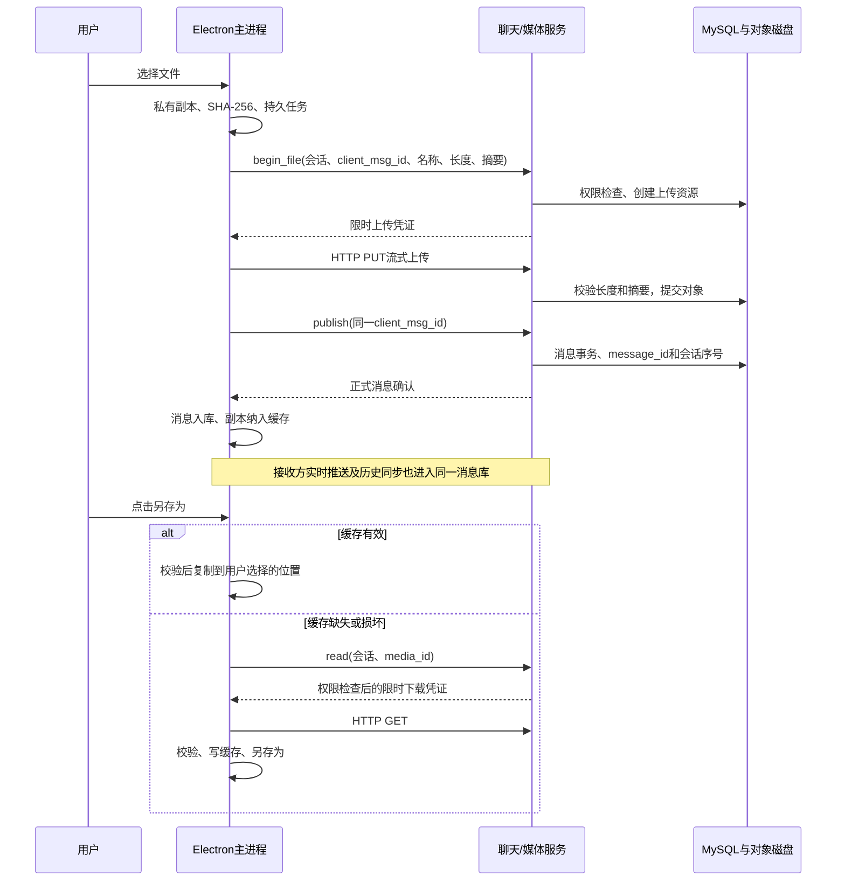

# 普通文件传输

单文件上限 **100 MiB**，允许空文件。普通文件作为字节流传输，不解析文档、压缩包或音视频；JPEG/PNG 沿用图片链路。支持进度、取消、失败整文件重传、历史消息、本地缓存和另存为，不包含断点续传与自动打开。

## 使用与存储

选择联系人或群后点击“文件”。发送前将源文件复制到账号私有任务目录，之后不再依赖原路径。发送成功后，这份副本纳入缓存。未完成任务保存在“待发送”中，重新登录后可重试。

文件卡片显示名称和大小。历史加载只同步消息元数据，不自动下载文件内容；点击“另存为”选择目标位置后，先校验本地缓存，缺失或损坏时才向服务端下载。下载提供百分比及取消，失败后可重新保存。先写临时文件并校验 SHA-256，再替换目标文件；用户保存的副本不会被缓存清理删除。

消息和资源索引放在 Electron userData 的 `images/<服务地址摘要>/<账号>/chat.db`，该目录名称沿用现有存储配置，内容包括图片与普通文件。缓存共用 256 MiB 的容量上限；服务端磁盘存文件内容，MySQL 只存资源编号、对象键、名称、长度、摘要、状态和消息关联。文件名不参与服务端路径拼接。

## 链路

## 代码入口

- `src/media_client.js`：图片与文件共用的持久任务、上传确认、缓存和保存。
- `src/media_transfer.js`：流式 HTTP、字节限制、进度、超时与取消。
- `src/message_store.js`：SQLite 消息、资源索引与同步游标。
- `src/desktop_bridge.js`、`src/preload.js`：原生文件对话框与受限 IPC。
- `src/file_view.js`：文件卡片和下载状态；`src/renderer.js` 接入会话与任务列表。
- 后端 `migrations/003_chat_files.sql`、`src/server/media_service.cpp`、`src/server/db/media_repository.cpp`：文件元数据和上传、发布、授权下载。

## 部署前提

2026-09-21 已应用 003 迁移并部署文件服务，现有消息与图片保留。现有 SSH 隧道及 6000/6002 端口方案不变；隧道运行时可直接 npm run dev。

部署时先备份数据库、对象目录和服务配置，确认 001/002 已应用；停服后执行 003，替换本次 Linux Release 产物，启动并验证文件收发。003 会扩大枚举和约束；已有文件消息后不能仅换回旧二进制作为完整回滚，应使用一致的数据库与对象备份。

## 实施进度

- [x] 真实服务失败测试、资源元数据迁移、文件上传发布下载。
- [x] 复用客户端任务与缓存，接入文件卡片、进度、取消和另存为。
- [x] 图片回归、文件集成验证、链路与部署说明。

验证：客户端本地 20/20、服务端 18 项通过（2 项 Windows 专属检查另跑），最终 Windows 在线/离线集成 121.221 秒通过，包含真实上传取消。完整构建与验证记录在后端 docs/file-transfer-verification.md。
