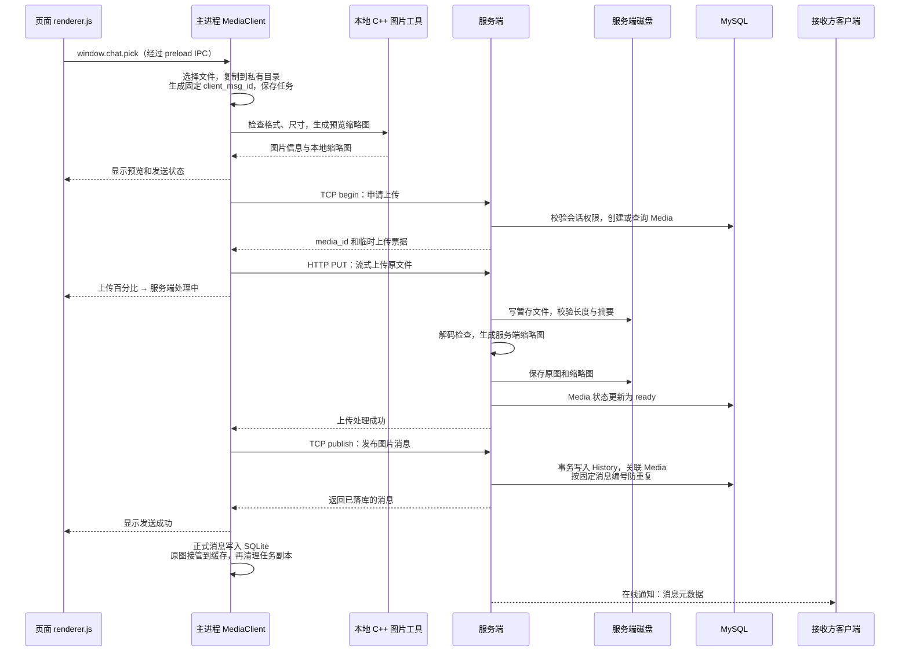
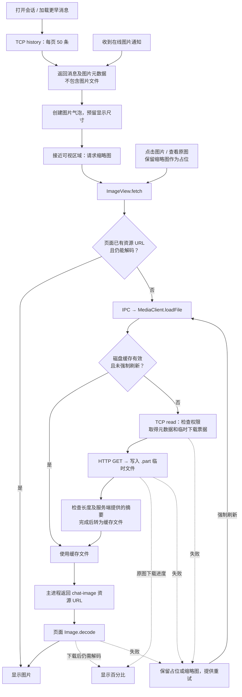
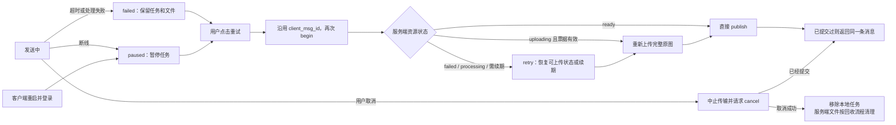

# 图片功能链路图

本地消息存储、同步范围和发送图片接管缓存的完整说明见 [LOCAL_STORAGE.md](LOCAL_STORAGE.md)，其中也列出后端尚待编译部署的限制。

以下对应当前客户端实现。使用支持 Mermaid 的 Markdown 预览查看图形；代码入口均指向本项目文件。

## 1. 发送：文件上传与消息发布

- 上传 100%：文件请求体已发出，服务端可能仍在校验和处理。
- `ready`：图片资源可用，尚不等于已经发送聊天消息。
- `publish` 确认：消息已落库；不表示接收方已经下载或阅读。
- 在线通知失败不回滚已提交的消息；接收方可通过历史接口获取消息。
- 客户端缩略图用于发送预览；服务端根据上传的原文件独立校验并生成供接收方使用的缩略图。

## 2. 历史、缩略图和原图

页面 URL 缓存命中时先验证能否解码；强制刷新会绕过该缓存。主进程先检查当前账号的资源索引、文件长度及本地摘要，命中后无需网络；否则向服务端申请下载。原图还校验服务端提供的摘要，缩略图的本地摘要在入缓存时计算。

原图下载期间显示百分比；收到全部字节后显示“图片解码中”，最终替换图片。缩略图使用加载占位和失败重试，不逐张显示百分比。

## 3. 失败、重试和取消

图中省略了仍会返回错误的分支：重试或取消失败会保留任务供继续处理。带取消标记的任务在登录恢复后保留取消意图，继续时执行取消；尚未申请资源的任务只需清理本地副本。

确认包丢失时，服务端可能已经提交消息，因此重试保持同一个 `client_msg_id`。当前上传中断后从头传完整文件，没有分片断点续传。

| 场景 | 客户端处理 |
| --- | --- |
| 关闭原图预览 | 取消下载，失效的回调不再更新预览 |
| 切换会话 | 取消旧缩略图请求；历史结果检查会话和请求身份 |
| 原图失败 | 保留缩略图，提供重试入口 |
| 缩略图失败 | 可重试缩略图，也可独立点击“查看原图” |
| 加载更早历史 | 按消息 ID 游标分页，插入后补偿滚动位置 |
| 缓存损坏 | 主进程检查失败后重新下载；页面解码失败时提供重试 |
| 切换账号或断线 | 暂停操作、清理页面资源；任务和磁盘缓存按服务地址及账号隔离 |

## 4. 存储位置与网络边界

| 内容 | 保存位置 |
| --- | --- |
| 待发送文件副本、预览和 tasks.json | Electron userData 下的 images / 服务地址摘要 / 账号目录 |
| 已下载原图和缩略图 | 同账号目录下的 cache，容量上限 256 MiB |
| 服务端原图与缩略图 | 当前部署的 /home/lth/chat-media，通过磁盘对象存储访问 |
| 图片资源元数据 | MySQL Media 表 |
| 聊天消息及图片关联 | MySQL History 表 |
| 临时访问票据 | 服务端内存，按有效期和登录连接约束访问 |

图片控制请求通过 TCP（请求类型 26、响应 27），在线消息通知为 28；图片文件通过 HTTP PUT / GET 传输。当前 SSH 隧道将本机 16000 转发至服务器 6000，将本机 16001 转发至服务器回环 6002。隧道负责网络加密，不参与图片状态和存储逻辑。

## 5. 对照代码阅读

| 关注点 | 代码入口 |
| --- | --- |
| 选图、历史分页、接收消息、任务更新 | [src/renderer.js](src/renderer.js)：loadHistory、receiveImage、image-send 点击事件 |
| 页面进入主进程 | [preload.js](preload.js)：window.chat；[src/desktop_bridge.js](src/desktop_bridge.js)：handlers、rpc |
| 发送与持久任务 | [src/media_client.js](src/media_client.js)：enqueue、run、save、login |
| 重试与取消 | [src/media_client.js](src/media_client.js)：retry、cancel、finishCancel |
| 下载与磁盘缓存 | [src/media_client.js](src/media_client.js)：loadFile、trimCache |
| 懒加载、原图预览、解码 | [src/image_view.js](src/image_view.js)：bubble、fetch、open、close |
| 文件流、进度、超时和中止 | [src/media_transfer.js](src/media_transfer.js)：transferFile |
| 调用本地 C++ 图片工具 | [src/image_processor.js](src/image_processor.js)：processImage |
| TCP 响应与请求匹配 | [src/tcp.js](src/tcp.js)：sendAndWait |

服务端项目中的对应入口：`src/server/media_service.cpp` 处理控制请求和 HTTP 文件传输，`src/server/db/media_repository.cpp` 处理授权、资源状态和消息事务，`src/server/chatservice.cpp` 负责协议入口及在线通知。

运行和故障排查见 [IMAGE_FEATURE.md](IMAGE_FEATURE.md)。OSS、视频、动图、粘贴/拖放和分片续传不属于当前已实现链路。
