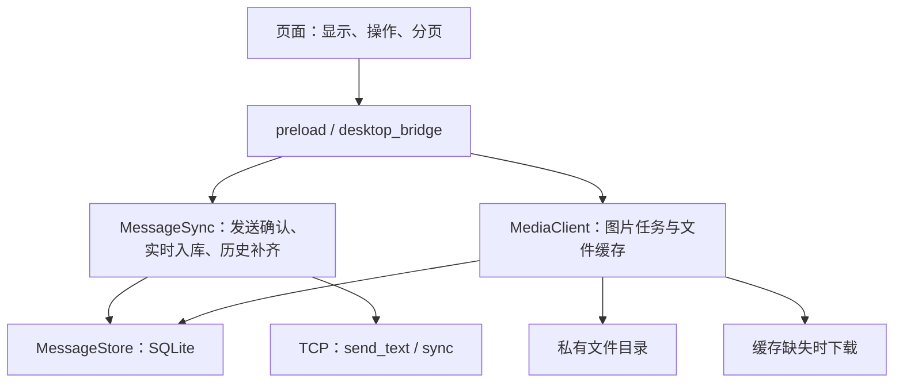

# 本地消息与图片存储

## 当前验收状态

2026-09-20：WSL 已恢复。Electron 内置 Node 下的 19 项测试、真实 MySQL 5 项迁移与并发测试通过。服务端已完成 Linux x86-64 Release 编译，9 项服务协议测试通过，覆盖文本确认、幂等重发、历史同步与实际 Windows 图片客户端。

真实客户端已验证 55 条离线消息补齐、实时消息不推进同步覆盖、重复同步去重、文本断线重试，以及 58 条消息关闭数据库后重新读取。真实窗口已验证历史缩略图、原图、文本发送确认和断线后的本地文字/图片。服务停止时未登录连接阻止退出的问题已修复并通过回归。

此前窗口缩略图偶发超时本轮未复现，原因仍未确认；本轮还出现一次测试服务启动超时，已补诊断日志，不能宣称所有偶发问题已消除。

**2026-09-21 已上线：生产库完成备份和恢复校验，已应用 002 迁移，6000 端口运行已验证产物。** 图片接口位于远程 `127.0.0.1:6002`，仍通过 `npm run tunnel` 映射到本地 16000/16001 后使用 `npm run dev`。

## 模块边界



- [message_store.js](src/message_store.js)：持久消息、待发送状态、同步覆盖范围、资源索引；SQLite 事务串行执行。
- [message_sync.js](src/message_sync.js)：发送文本、合并确认/推送、按会话补齐，不负责图片下载。
- [media_client.js](src/media_client.js)：独立管理上传和缓存；消息确认后保存正式消息，再接管文件。
- [desktop_bridge.js](src/desktop_bridge.js)：管理当前账号和网络认证状态，页面只能通过限定 IPC 访问。

## 磁盘内容

```text
Electron userData/
  images/<服务地址摘要>/<账号>/
    chat.db                 消息、同步范围、资源索引
    chat.db-wal / -shm      SQLite 使用中的辅助文件
    tasks.json              持久图片发送任务
    <任务UUID>/original     发送副本
    <任务UUID>/preview/     发送预览
    cache/<media_id>-original
    cache/<media_id>-thumbnail
    cache/<media_id>-preview
```

`preview` 是本地工具生成的预览，不冒充服务端缩略图；界面可用它展示自己发出的图片。用户原路径在复制后不再依赖。原图缓存接管会核实大小和 SHA-256。

消息记录与附件缓存分开：256 MiB 文件缓存回收不会删除聊天记录。发送中、失败及待接管的副本不属于可回收缓存。关闭应用时等待任务停下并关闭 SQLite；备份正在打开的数据库不能只复制 `chat.db` 而忽略 WAL。

## 发送与确认

文本先保存本地 `pending` 记录，再发送 `send_text`。确认返回的 `message_id` 与客户端 `client_msg_id` 合并到原记录；超时显示尚未确认，使用同一个编号重试。正式消息用同一封套承载 `kind=text/image`。

图片确认后把完整返回消息保存在任务中，写入消息表，然后复制原图到缓存暂存文件、原子重命名、更新资源索引，最后删除任务副本。任何接管失败都保留确认结果和副本，不能当作消息未发送；再次登录或重试可以继续整理缓存。

## 历史与同步

页面先调用 `history` 读取本地页，再调用 `syncHistory` 补齐。实时事件、文本确认和图片确认都进入消息存储。页面按消息身份合并，不按文本内容去重。

服务端保留全局 `message_id`，另有每会话递增 `sequence` 用于同步排序。数据库插入触发器在事务中锁定会话计数器，确保序号与提交顺序一致；失败回滚不推进计数器。

- 首次同步拉最新一页，保存已覆盖下界和上界。
- 重连/打开会话：从已同步上界正序补齐，分页使用固定 `through` 上界。
- 向上翻页：本地有已覆盖页面就直接读取，否则从覆盖下界补齐更早消息。
- 实时消息只能增加记录，不能推进同步游标。消息和对应范围在同一个 SQLite 事务提交。

服务端删除/撤回同步不在当前范围；未打开会话不主动下载全部历史。保持本地副本不等于保证服务端资源永久可下载。

## 断网与账号

当前账号已登录后断线，保留聊天界面和本地读取能力，禁用发送，并提供“重新登录”。图片先校验本地索引与实际文件，有效就直接读取，缺失或损坏且离线时显示失败提示。

账号切换等待旧操作结束后打开对应目录，清理页面资源和旧账号回调。**应用冷启动仍需登录；不提供未经认证的离线账号选择。** 已经下载到本地的内容不会因远端撤销权限而自动消失。

## 验证与部署顺序

本地测试：`npm test`，使用 Electron 自带 Node 和 `resources/native/chat_image.exe`。SQLite 依赖为 `sqlite3@5.1.7`，已在 Electron 28 内验证原生模块加载；安装时存在其间接依赖的弃用提示，未修改系统 Node/Electron 版本。

后端需停止写入并备份后应用 `migrations/002_message_sequence.sql`，完成编译和 `tests/message_service_test.py` 验证，再部署并启用此客户端。迁移包含 DDL，不是单事务，失败时不能盲目重复整份脚本。回退代码不删除新增列、表或本地记录。

实际服务集成入口为后端 `tests/client_storage_test.py`，调用前端 `tests/run_service.js`，使用随机测试库、独立端口和临时客户端目录。日志及窗口截图位于 `F:\linux\_environment\logs\client-storage`。冷启动离线登录、OSS和通用文件不属于本次功能范围。
